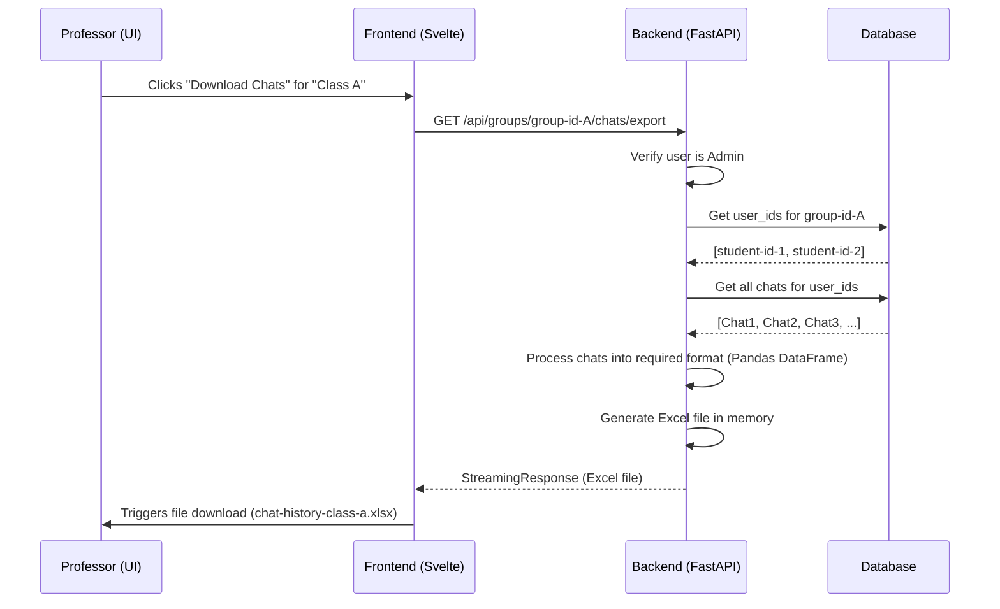

# Chat History Export Feature: Architecture & Implementation Plan

This document outlines the architecture of the Open WebUI system and provides a detailed plan for implementing a feature that allows professors (admins) to download the chat history of students within specific groups.

## 1. Current System Architecture

The application is a modern web application with a distinct frontend and backend.

-   **Frontend**: Built with **SvelteKit**, a Svelte framework. It's a Single Page Application (SPA) that communicates with the backend via a REST API.
-   **Backend**: An API built with **FastAPI** (Python). It handles business logic, database interactions, and authentication.
-   **Database**: Uses **SQLAlchemy** as an ORM to interact with a SQL database (like SQLite or PostgreSQL). Chat history itself is stored in a flexible `JSON` field.

### High-Level Architecture Diagram

```mermaid
graph TD
    A[User/Professor Browser] -->|HTTPS| B(Frontend - SvelteKit);
    B -->|API Calls (REST)| C{Backend - FastAPI};
    C -->|SQLAlchemy ORM| D[Database (SQLite/PostgreSQL)];

    subgraph "Frontend (src/)"
        B;
    end

    subgraph "Backend (backend/)"
        C;
    end

    subgraph "Database"
        D;
    end
```

## 2. Core Data Models & Relationships

The core of the system revolves around Users, Groups, and Chats.

-   `User`: Represents an individual user. Has a `role` (`admin`, `user`, `pending`).
-   `Group`: A collection of users. Used to manage permissions and organize users (e.g., by class).
-   `Chat`: Stores a single conversation. It's linked to a `user_id` and contains the entire conversation history within a `chat` JSON blob.

### Entity-Relationship Diagram

```mermaid
erDiagram
    USER {
        string id PK
        string email
        string name
        string role
        --
        list_of_groups
    }

    GROUP {
        string id PK
        string name
        string description
        json permissions
        json user_ids FK
    }

    CHAT {
        string id PK
        string user_id FK
        string title
        json chat
        timestamp created_at
    }

    USER ||--o{ GROUP : "is member of"
    USER ||--|{ CHAT : "owns"

```
*Note: The `USER` to `GROUP` relationship is managed via the `user_ids` array in the `GROUP` table.*

## 3. Authentication & Authorization

-   **Authentication**: Uses JWT (JSON Web Tokens). On successful login, a token is generated and stored in a cookie. This token is sent with subsequent API requests.
-   **Authorization**: The backend uses FastAPI's dependency injection to protect routes.
    -   `get_current_user`: Ensures a valid token is present.
    -   `get_verified_user`: Ensures the user is not in a 'pending' state.
    -   `get_admin_user`: Ensures the user has the `admin` role.
-   **Permissions**: A fine-grained permission system exists, allowing control over features like `chat.delete` or `admin_chat_access`. These are often tied to groups.

## 4. Proposed Feature: Chat History Export

The goal is to allow a Professor (an `admin` user) to download an Excel/CSV file containing all chat histories for all students ( `user` role) within a specific group.

### Implementation Scope & Options

#### Option 1: Extend Groups Router (Recommended)
-   **Location**: `backend/open_webui/routers/groups.py`
-   **Endpoint**: `GET /groups/{group_id}/chats/export`
-   **Pros**: Logically groups the export functionality with group management. It's clean and RESTful.
-   **Cons**: None significant. This is the best approach.

#### Option 2: Extend Chats Router
-   **Location**: `backend/open_webui/routers/chats.py`
-   **Endpoint**: `GET /chats/export/group/{group_id}`
-   **Pros**: Keeps all chat-related logic in one file.
-   **Cons**: Less intuitive, as the primary resource is the group, not the chat.

### Development Plan

#### Phase 1: Core Functionality (MVP)

1.  **Backend Development**:
    -   **Create New Endpoint**: Implement `GET /groups/{group_id}/chats/export` in `groups.py`. This endpoint will be protected by `Depends(get_admin_user)`.
    -   **Database Logic**:
        -   In `backend/open_webui/models/groups.py`, get the list of `user_ids` for the given `{group_id}`.
        -   In `backend/open_webui/models/chats.py`, create a new function `get_chats_by_user_ids(user_ids: list[str])` to fetch all chats for a list of users.
    -   **Data Processing & Export**:
        -   Install `pandas` and `openpyxl` to the backend environment (`pip install pandas openpyxl`).
        -   In the new endpoint, fetch the chats for the group's users.
        -   Iterate through the chats and messages to structure the data as required (NetID, Model Used, Message Count, etc.).
        -   Use Pandas to create a DataFrame from the structured data.
        -   Use `io.BytesIO` to create an in-memory Excel file from the DataFrame.
        -   Return a `StreamingResponse` with the appropriate headers for file download.

2.  **Frontend Development**:
    -   **Modify Group UI**: In `src/lib/components/admin/Users/Groups.svelte`, add a "Download Chats" icon button to each group row.
    -   **API Call**: When the button is clicked, call a new API function (e.g., `exportGroupChats(token, groupId)` in `src/lib/apis/groups/index.ts`).
    -   **File Handling**: The API function will fetch the file as a `blob` and use `file-saver` (which is already a dependency) to trigger the download in the user's browser.

#### Phase 2: Enhancements
-   Add UI options for filtering by model, date range, etc., before exporting.
-   Include additional metadata in the export (time taken, full chat content).
-   Add a "Download All" button for all groups.
-   Implement visual feedback (e.g., a toast notification) for download initiation and completion.

### Sequence Diagram for Chat Export



### Key Files to Modify

-   `backend/open_webui/routers/groups.py`: To add the new export endpoint.
-   `backend/open_webui/models/chats.py`: To add the function for fetching chats by multiple user IDs.
-   `backend/requirements.txt`: To add `pandas` and `openpyxl`.
-   `src/lib/components/admin/Users/Groups.svelte`: To add the download button to the UI.
-   `src/lib/apis/groups/index.ts`: To add the new frontend API function to call the export endpoint.

This plan provides a clear path forward, starting with a robust MVP and building on it with enhancements. It aligns with the existing architecture and best practices of the application.
